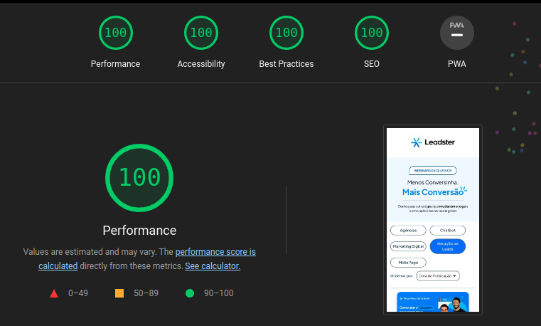
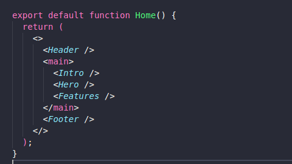

# Sobre o Projeto:

Este projeto é destinado ao desafio técnico para a vaga de Desenvolvedor Front-end da empresa Leadster (https://leadster.com.br). Consiste o projeto em uma landing page com o intuito de avaliar as habilidades básicas de desenvolvimento com foco no framework Next.js.

Link da vaga: https://www.linkedin.com/jobs/view/3642375120/?refId=9420e230-8117-4757-a099-a12312ff515d&trackingId=EB6TJQqKT4awevwq3I47xw%3D%3D

Deploy do projeto: https://teste-front-leadster-gamma.vercel.app/

## Performance e Critério de Acessibilidade Conforme o Google LightHouse

## Tecnologias Utilizadas:

Neste projeto foram utilizadas as seguintes tecnologias:

- Utilização do Next.js com TypeScript: O Next.js fornece um ambiente de desenvolvimento robusto e eficiente para a criação de aplicativos React. A adição do TypeScript permite uma tipagem estática e maior segurança durante o desenvolvimento.

- Utilização do Tailwind CSS: O Tailwind CSS é um framework utilitário CSS que permite a construção rápida e fácil de interfaces. Ele fornece uma ampla gama de classes pré-definidas que podem ser combinadas para criar estilos personalizados.

- Utilização do Jest + RTL: O Jest é um framework de testes JavaScript amplamente utilizado. O uso do RTL (React Testing Library) facilita a escrita de testes para componentes React, garantindo que as funcionalidades básicas estejam funcionando corretamente.

- Utilização do clsx para estilizações condicionais: O clsx é uma biblioteca JavaScript que permite a criação de classes condicionais com base em uma determinada condição. Isso torna mais fácil aplicar estilos dinamicamente aos componentes, melhorando a flexibilidade e a reutilização do código.

- Utilização do Phosphor Icons: O Phosphor Icons é uma biblioteca de ícones com uma ampla variedade de ícones modernos e estilizados. Esses ícones podem ser facilmente incorporados ao projeto, fornecendo uma experiência visual agradável.
## Organização de Pastas:

- Os componentes foram agrupados na pasta components, com uma subpasta UI para os componentes de layout puro. Cada componente específico tem sua própria pasta com um arquivo index.tsx como o código principal do componente. Em alguns casos, pode haver outros componentes auxiliares dentro da pasta do componente.

- As interfaces globais do projeto foram colocadas na pasta interfaces.

- Os principais componentes/seções são: Header, Intro, Hero, Features e Footer.

- Os principais componentes estão organizados no arquivo page.ts, com a seguinte estrutura:

## Funcionalidades do Projeto:

Este projeto possui as seguintes funcionalidades:

- Filtros: O aplicativo possui filtros para ajudar na navegação e filtrar o conteúdo exibido. Basta clicar em qualquer botão de filtro.

- Modal de vídeo: Existe um modal para reproduzir vídeos específicos. Basta clicar na thumbnail de algum Card para abrir o modal.
## Como rodar o projeto:

Para executar o projeto, siga as instruções abaixo:

- Clone o repositório para a sua máquina local: git clone <URL_do_repositório>
- No terminal, navegue até o diretório raiz do projeto clonado.
- Instale as dependências do projeto executando o seguinte comando no terminal: npm install
- Após a conclusão da instalação das dependências, você pode iniciar o servidor de desenvolvimento com o seguinte comando: npm run dev. Isso iniciará o servidor de desenvolvimento do Next.js e você poderá acessar o projeto no seu navegador através do endereço http://localhost:3000.
- Para executar os testes, utilize o seguinte comando: npm test
